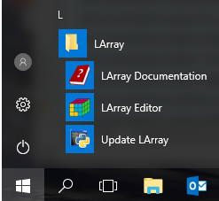

Sample 1
=========

내용

목차 구조- 상위
---------------

목차 구조 - 하위 1
^^^^^^^^^^^^^^^^^^

목차 구조 - 하위 2
^^^^^^^^^^^^^^^^^^

강조, 경고, 팁 메시지
---------------------

.. note::

    내용

.. warning::

    내용

.. tip::

    내용
    
구조체 설명
-----------

구조체 필드:

+-------------------+---------------------------------------------------------------------------------------+
| Field             | Description                                                                           |
+===================+=======================================================================================+
| id                | Id                                                                                    |
+-------------------+---------------------------------------------------------------------------------------+
| items             | items                                                                                 |
+-------------------+---------------------------------------------------------------------------------------+

샘플 코드 - bash
-----------------

.. code-block:: bash

    $ curl http://demo.sylius.org/api/v1/carts/ \
        -H "Authorization: Bearer SampleToken" \
        -X POST \
        --data '
            {
                "customer": "shop@example.com",
                "channel": "US_WEB",
            }
        '

샘플 코드 - text
----------------

.. code-block:: text

    STATUS: 201 Created

샘플 코드 - json
-----------------

.. code-block:: json

    {
        "id":21,
        "itemsTotal":0,
        "adjustments":[

        ],
        "total":0,
        "customer":{
            "id":1,
            "lastName":"Doe",
            "user":{
                "id":1,
                "username":"shop@example.com",
                "usernameCanonical":"shop@example.com"
            },
            "_links":{
                "self":{
                    "href":"\/api\/v1\/customers\/1"
                }
            }
        },
        "checkoutState":"cart"
    }

샘플 코드 - ::
-----------------

::

  a,b\c,c0,c1
  a0,b0,0,1
  a0,b1,2,3

글머리 기호 유형
----------------

* :py:func:`a` : a
* :py:func:`b` : b

  * 내용
  * 내용

   * 내용
   * 내용

- 내용
- 내용

- 내용

글씨 유형
---------
내용 `내용` ``내용`` 

- **내용** <test@navercorp.com>

:py:func:`compare`

:mod:`apps.manager.constants`

:attr:`내용`

그림
----

.. image:: _static/editor.png
    :align: center

링크
---------

**링크 예제 1**

- Docker_
- MySQL_ 5.7

**링크 예제 2**

- npm_, Gulp_

.. _Docker: https://www.docker.com/
.. _MySQL: https://www.mysql.com/
.. _npm: https://npmjs.com/
.. _Gulp: http://gulpjs.com/